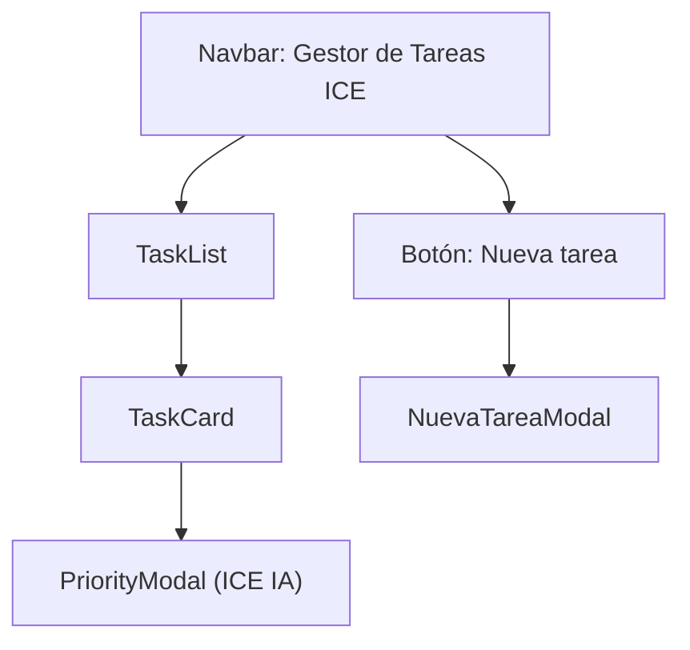
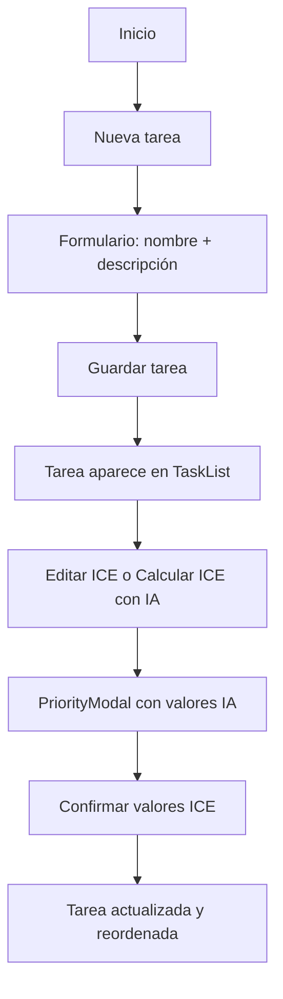
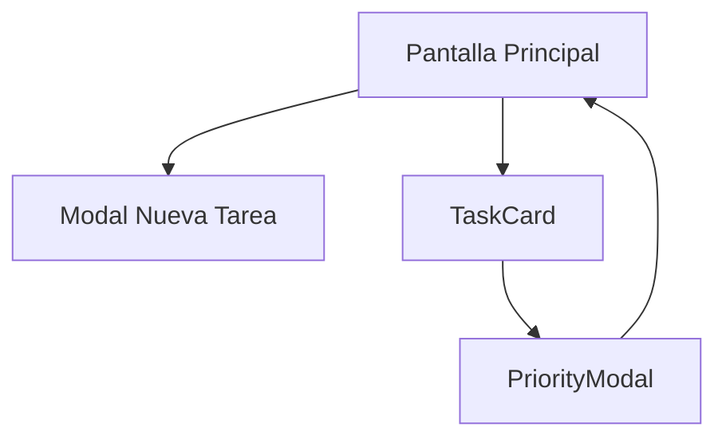

# Diagramas visuales – Gestor de Tareas ICE

## Jerarquía visual de componentes

```mermaid
flowchart TD
    Navbar["Navbar: Gestor de Tareas ICE"]
    NuevaTareaBtn["Botón: Nueva tarea"]
    TaskList["TaskList"]
    TaskCard["TaskCard"]
    PriorityModal["PriorityModal (ICE IA)"]
    NuevaTareaModal["NuevaTareaModal"]
    Navbar --> NuevaTareaBtn
    Navbar --> TaskList
    NuevaTareaBtn --> NuevaTareaModal
    TaskList --> TaskCard
    TaskCard --> PriorityModal
```

---

## Flujo de creación de tarea

```mermaid
flowchart TD
    Inicio["Inicio"] --> NuevaTarea["Nueva tarea"]
    NuevaTarea --> Formulario["Formulario: nombre + descripción"]
    Formulario --> Guardar["Guardar tarea"]
    Guardar --> Lista["Tarea aparece en TaskList"]
    Lista --> EditarICE["Editar ICE o Calcular ICE con IA"]
    EditarICE --> ModalICE["PriorityModal con valores IA"]
    ModalICE --> Confirmar["Confirmar valores ICE"]
    Confirmar --> Actualiza["Tarea actualizada y reordenada"]
```

---

## Flujo de navegación del usuario

```mermaid
flowchart TD
    Home["Pantalla Principal"] --> NuevaTarea["Modal Nueva Tarea"]
    Home --> TaskCard["TaskCard"]
    TaskCard --> PriorityModal["PriorityModal"]
    PriorityModal --> Home
```
